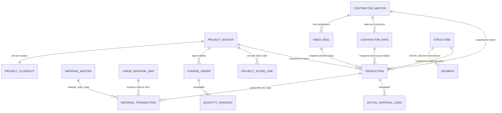

# Architecture and Data Relationships  (Sprint 23.77 #24, #25)

## The one idea the whole system rests on

**A production transaction is a physical copy of everything it needs.**

When a crew picks a project, contractor, rate, reel or structure, Fulcrum's
RecordLink `record_defaults` copy that master's values *onto the transaction*.
Nothing downstream ever re-reads a master to work out a historical figure.

That single decision buys three things at once:

1. **Offline capability.** Every validation reads local fields, so it works
   with no signal.
2. **Historical immutability.** Repricing the rate sheet in March cannot change
   what January's production was worth.
3. **Scale.** No lookup per keystroke, no query per save — at hundreds of
   thousands of records it costs nothing.

The three arguments arrived in Sprints 2, 12 and 19 independently and all point
the same way.

## Where a rule is allowed to live

| Kind of rule | Home | Why |
|---|---|---|
| A fact stated by the contract code | Data Events | Parsing `BM60(3)(1.25)` for its pull count is *reading* the contract. |
| What a pay unit consumes, and at what price | A master app | That is a business decision; it changes without a code deploy. |
| Anything needing another record | A Query API report | A device cannot see other records, online or not. |
| A total | **Nowhere** | Totals are computed at query time from atomic transactions. |

## Architecture

```
  FIELD                        PLATFORM                    REPORTING
  ─────                        ────────                    ─────────

  Fulcrum mobile ──sync──►  Mainline Construction  ──►  Query API (SQL)
  (offline-first)           (production txns)            24 reports
        │                          │                          │
        │  Data Events             │ RecordLink               ├─ production daily/weekly/monthly
        │  • derive                │ record_defaults          ├─ financial (project, contractor)
        │  • validate              │ (physical copy)          ├─ scope + remaining work
        │  • fingerprint           │                          ├─ forecasting + productivity
        │  • gate approval         ▼                          ├─ QA + exception dashboard
        │                   ┌──────────────┐                  ├─ duplicate + overlap + segment
        │                   │ MASTER APPS  │                  ├─ material variance + reel balance
        │                   ├──────────────┤                  ├─ audit trail
        │                   │ Project      │                  └─ closeout readiness
        │                   │ Contractor   │
        │                   │ Rate  ×146   │           memberships (platform)
        │                   │ Reel         │              └─ who created / updated
        │                   │ Structure    │
        │                   │ Segment      │
        │                   │ Material     │
        │                   │ Mapping      │
        │                   │ Scope Line   │
        │                   │ Change Order │
        │                   │ Closeout     │
        │                   └──────────────┘
        │
        └── never calls out. No REQUEST, no fetch, no token.
```

**Nothing crosses from reporting back into the record.** No report writes, no
webhook recalculates history. Corrections happen through the approval workflow,
by a person.

## Data relationships



**Every relationship into PRODUCTION is a snapshot, not a live join.** The link
is kept for navigation; the *values* are copied. That is why a renamed
contractor, a repriced rate or a corrected reel range cannot alter a historical
record.

### Authorized scope is computed, never stored

```
authorized = scope_line.original_planned_quantity
           + SUM(change_order_lines WHERE order status = APPROVED)

remaining  = authorized − SUM(production WHERE _status = APPROVED)
```

Remaining is **not clamped at zero**: an over-run reads negative, because that
is the number a manager needs.

### Identity

| Identity | Rule |
|---|---|
| `production_id` | Set once from the platform record ID, never regenerated. Sequential numbering is not offline-safe — two crews out of service both take 124. |
| `segment_id` | Endpoints sorted before joining, so A→B and B→A are one segment. |
| `span_id` | Same rule for poles. |
| `fingerprint_strict` | project, contractor, day, pay unit, cable, direction-normalized sequential range. |
| `fingerprint_segment` | project, contractor, day, pay unit, segment. The only duplicate signal for bore and trench work. |
| Creator | `_created_by_id` → `memberships`. Never copied onto the record — a copy goes stale. |

## App inventory

| App | Role |
|---|---|
| Mainline Construction | Production transactions. 140 elements, Data Events v7.3.0. |
| MC Project Master | Projects. |
| MC Contractor Master | Contractors. |
| MC Contractor Rate | 146 pay units. The pricing source of truth. |
| MC Fiber Reel | Reels. Printed range only — consumption is computed. |
| MC Structure | Handholes, vaults, pedestals, poles. |
| MC Segment | FROM→TO paths, direction-normalized. |
| MC Material Master | Stock items. |
| MC Material Transaction | Atomic material ledger. Balances are never stored. |
| MC Labor-Material Mapping | Pay unit → material multipliers. **Empty.** |
| MC Project Scope Line | Baseline scope, one per project + labor code. |
| MC Change Order | Signed scope deltas. |
| MC Project Closeout | Eleven milestones, readiness review, authorized override. |

IDs in `docs/fulcrum-inventory.md`.
